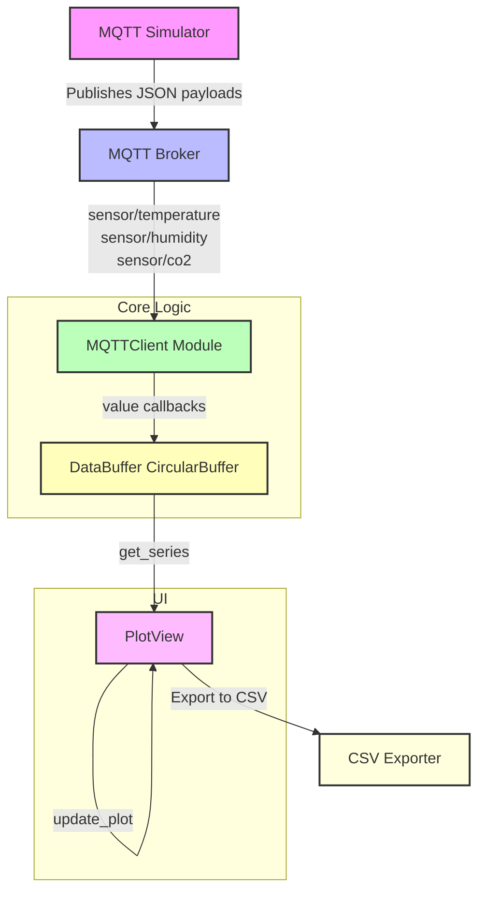

# Sensor Data Logger & Visualizer

The Sensor Data Logger & Visualizer is a *ominous* application that simulates, collects, buffers, and displays real-time sensor data streams.

---

## Architecture Diagram



---

## Components

1. **MQTT Simulator** (`simulator.py`)

   * Publishes randomized JSON payloads: `{'value': <float>}`
   * Topics: `sensor/temperature`, `sensor/humidity`, `sensor/co2`
   * Default rate: 1 Hz

2. **MQTTClient Module** (`mqtt_client.py`)

   * Connects to broker via TCP
   * Registers callbacks per topic before connecting
   * Subscribes on connect, parses JSON and dispatches values
   * Logs connection, subscription, messages, and errors

3. **DataBuffer** (`data_buffer.py`)

   * Thread-safe `CircularBuffer` storing `(timestamp, value)` pairs
   * Fixed capacity using deque
   * Methods: `append()` and `get_series()`
   * Logs buffer operations

4. **PlotView** (`plot_view.py`)

   * PySide6 `QWidget` with three side-by-side `pyqtgraph.PlotWidget`s
   * Bound to `QTimer` for periodic refresh
   * “Export to CSV” button concatenates buffers and writes via pandas
   * Logs UI setup, data fetch, plot update, and export

5. **Main Application**

   * **Entry Point**: `main.py`

     * Configures root logger
     * Starts Qt application
     * Defines topics and buffers
     * Instantiates `MQTTClient` and `MainWindow`
     * Registers handlers then calls `mqtt.connect()`
     * Shows GUI and enters event loop
     
   * **UI Layout**: `ui.py`
     * `PlotView` panel and Export button

---

## Installation & Usage Guide

Follow these steps to get the MQTT Sensor Data Logger & Visualizer up and running:

---

### 1. Clone the Repository

```bash
git clone https://github.com/CagriCatik/mqtt-sensor-data-logger-visualizer.git
cd mqtt-sensor-data-logger-visualizer
```

---

### 2. Install Python Dependencies

```bash
pip install -r requirements.txt
```

---

### 3. Start an MQTT Broker

Ensure an MQTT broker is running locally (default: `localhost:1883`).
Example (Mosquitto):

```bash
mosquitto
```

---

### 4. (Optional) Verify MQTT Connectivity

Use this script to confirm you can connect and subscribe/publish:

```bash
python verify_mqtt.py
```

---

### 5. Run the Sensor Simulator

This script publishes fake sensor readings to your broker:

```bash
python simulator.py
```

---

### 6. Launch the Main Application

Visualize and log incoming data in real time:

```bash
python main.py
```

