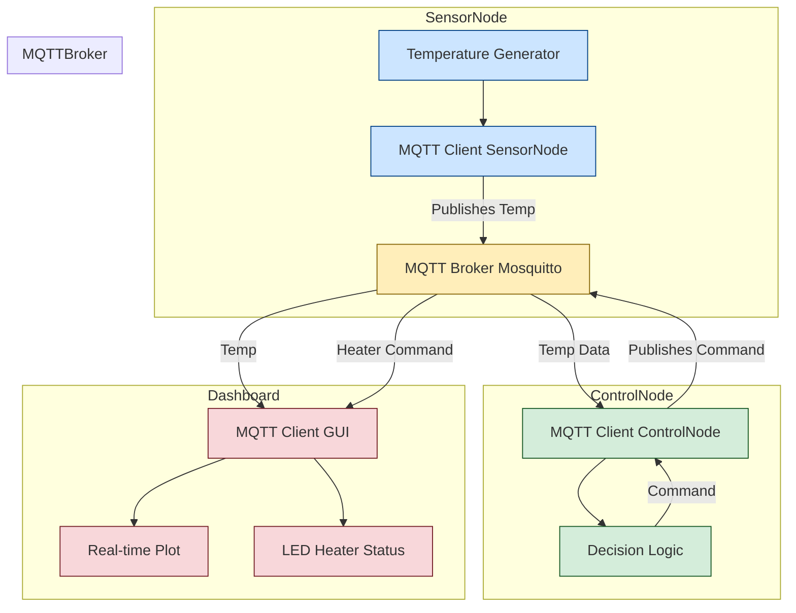

# SmartThermoMQ

SmartThermoMQ is a modular IoT simulation project using **MQTT** to demonstrate real-time sensor publishing, control logic, and data visualization.

It includes:
- 🟦 A **temperature sensor client** that simulates environmental data.
- 🟩 A **control node client** that makes heater control decisions.
- 🟥 A **GUI client** with a real-time PyQtGraph plot and LED status.
- 🟨 A public **MQTT broker** for message routing (`test.mosquitto.org`).

---

## 🚀 Features

- ✅ Realistic publish-subscribe model using MQTT
- ✅ MQTT communication via `paho-mqtt`
- ✅ Live PyQtGraph temperature plotting
- ✅ LED-style visual feedback for heater status
- ✅ Modular, extensible architecture

---

## 🗂 Project Structure

```bash
SmartThermoMQ/
│
├── sensor_node.py            # Simulates temperature readings
├── control_node.py           # Subscribes to temp, publishes heater commands
├── mqtt_gui_pyqtgraph.py     # PySide6 GUI with live graph and LED
├── mqtt_config.py            # Central MQTT topic and broker settings
└── README.md                 # Project documentation
```

---

## ⚙️ Installation

### 1. Clone the Repository

```bash
git clone https://github.com/yourname/SmartThermoMQ.git
cd SmartThermoMQ
```

### 2. Install Dependencies

```bash
pip install paho-mqtt PySide6 pyqtgraph
```

---

## 🌐 MQTT Configuration

Uses the public broker:

* **Broker**: `test.mosquitto.org`
* **Port**: `1883`
* **Topics**:

  * `home/temperature` – published by `sensor_node.py`
  * `home/heater_command` – published by `control_node.py`, read by GUI

---

## 🧠 Architecture



---

## 🧪 How to Run

### 1. Start the Control Node

```bash
python control_node.py
```

### 2. Start the Sensor Node

```bash
python sensor_node.py
```

### 3. Start the GUI Dashboard

```bash
python mqtt_gui_pyqtgraph.py
```

---

## 📉 GUI Preview

* **Live Temperature Plot** using `PyQtGraph`
* **LED Indicator**:

  * 🟢 `HEATER_ON`
  * 🔴 `HEATER_OFF`
  * ⚪ `STANDBY`

---

## 🔄 Message Flow Summary

| Component     | Publishes to          | Subscribes to                             |
| ------------- | --------------------- | ----------------------------------------- |
| Sensor Node   | `home/temperature`    | –                                         |
| Control Node  | `home/heater_command` | `home/temperature`                        |
| GUI Dashboard | –                     | `home/temperature`, `home/heater_command` |

