# MQTT – Illustrated Guide

## 0  Bird’s‑Eye Overview

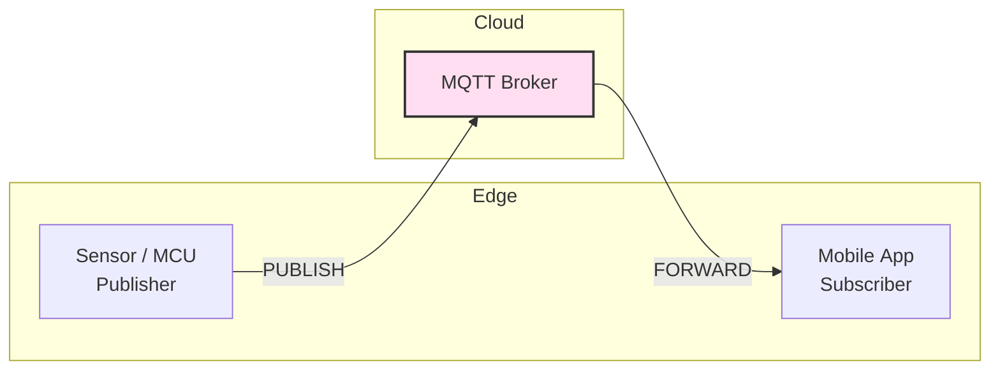

Tiny 🛰️ sensors speak TCP to a central **broker**; everybody agrees on **topics**, and QoS levels fine‑tune reliability.

---

## 1  MQTT Packet Zoo (all 15 types)

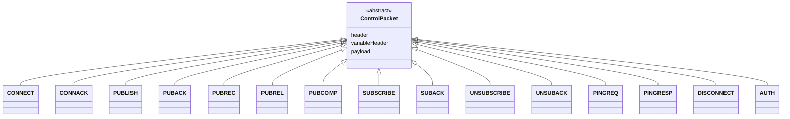

This diagram shows the inheritance relationship of every MQTT v5 control packet. All share the same **fixed header** followed by optional sections.

- **CONNECT (1)** — Client’s opening salvo establishing a session; includes ClientID, keep‑alive, clean‑start flag, Last‑Will, credentials, and (MQTT 5) properties.
- **CONNACK (2)** — Broker’s verdict on the CONNECT; returns a reason code and whether a previous session is present.
- **PUBLISH (3)** — Carries your application payload. Flags encode DUP, QoS, RETAIN; variable header holds Topic, Packet ID, and Properties.
- **PUBACK (4)** — One‑packet acknowledgement that completes the QoS 1 round‑trip.
- **PUBREC (5)** — Step 1 of the QoS 2 handshake (“received”).
- **PUBREL (6)** — Step 2, publisher releases the message for delivery.
- **PUBCOMP (7)** — Step 3, broker confirms completion; exactly‑once achieved.
- **SUBSCRIBE (8)** — Client requests one or more topic filters with desired QoS.
- **SUBACK (9)** — Broker replies with granted QoS—or a failure code—per filter.
- **UNSUBSCRIBE (10)** — Client drops one or more subscriptions.
- **UNSUBACK (11)** — Confirmation that the filters are gone.
- **PINGREQ (12)** — Heartbeat probe sent if no traffic during the keep‑alive window.
- **PINGRESP (13)** — Broker’s heartbeat echo proving the socket is still alive.
- **DISCONNECT (14)** — Graceful close or error signal; in MQTT 5 it can carry detailed reason codes and session‑expiry info.
- **AUTH (15)** — Optional extended authentication exchange (e.g., SASL, JWT refresh) added in MQTT 5.

---

## 2  Client Connection State‑Machine

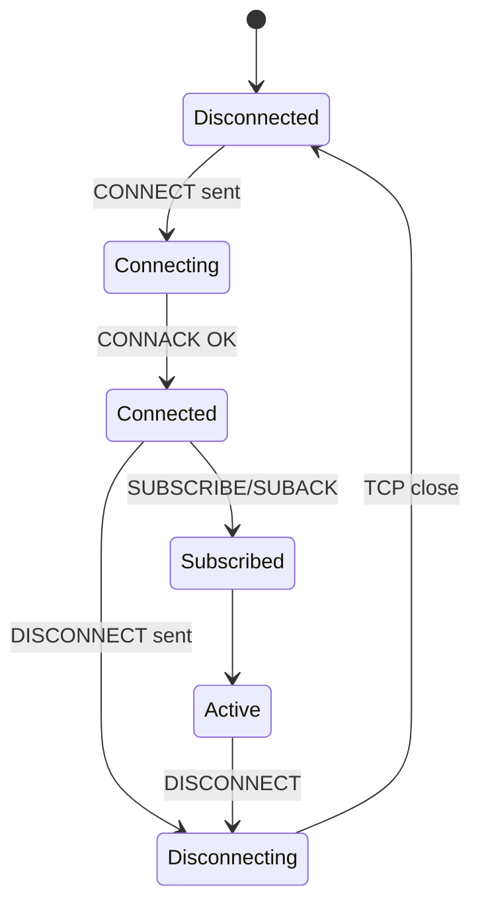

A client travels through **Connecting → Connected → Subscribed → Active**. Any ACK failure or TCP drop jumps it back to *Disconnected*.

---

## 3  QoS 2 Four‑Step Handshake (Detailed)

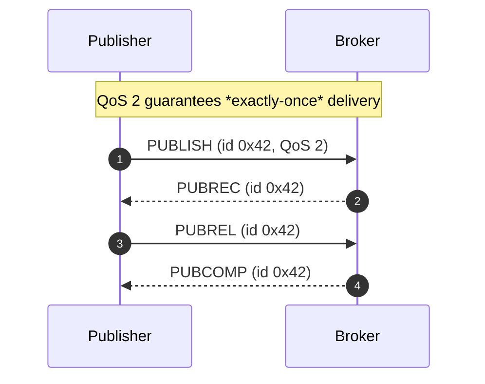

---

## 4  Keep‑Alive Heartbeat Timeline

```mermaid
gantt
    dateFormat  HH:mm:ss
    title Client ↔ Broker keep‑alive (60 s)
    section TCP
    CONNECT           :done, 00:00:00, 1s
    Idle wait         :       00:00:01, 59s
    PINGREQ           : done, 00:01:00, 1s
    PINGRESP          : done, 00:01:01, 1s
    Idle wait         :       00:01:02, 59s
    PINGREQ           : done, 00:02:01, 1s
```

If no application traffic appears inside one **keep‑alive window**, the client must send **PINGREQ/PINGRESP** to prove liveness.

---

## 5  TLS Handshake & Auth Pipeline

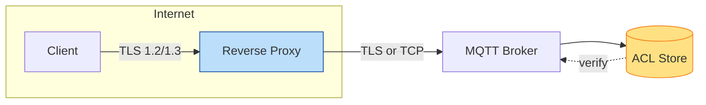

*TLS encrypts*, plugins authenticate, then **ACLs** authorise topic access.

---

## 6  Retained Message Lifecycle

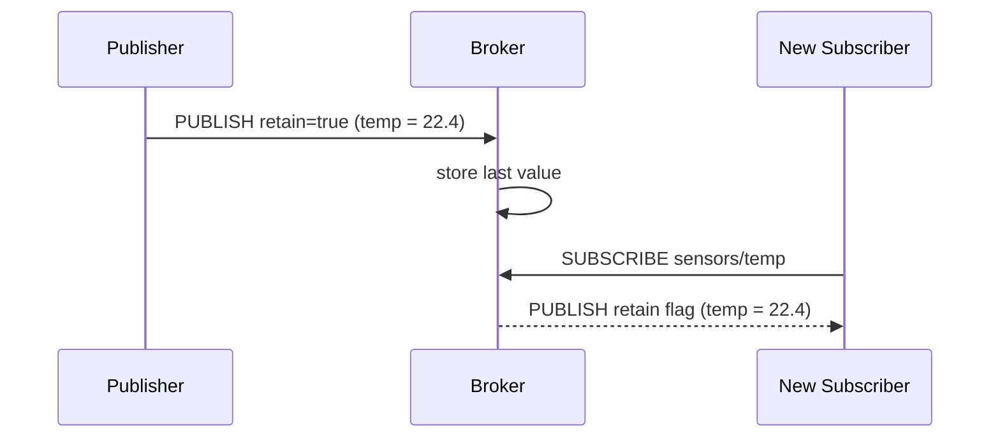

Retain flag == *instant snapshot* for newcomers.

---

## 7  Shared Subscription Load‑Balancing

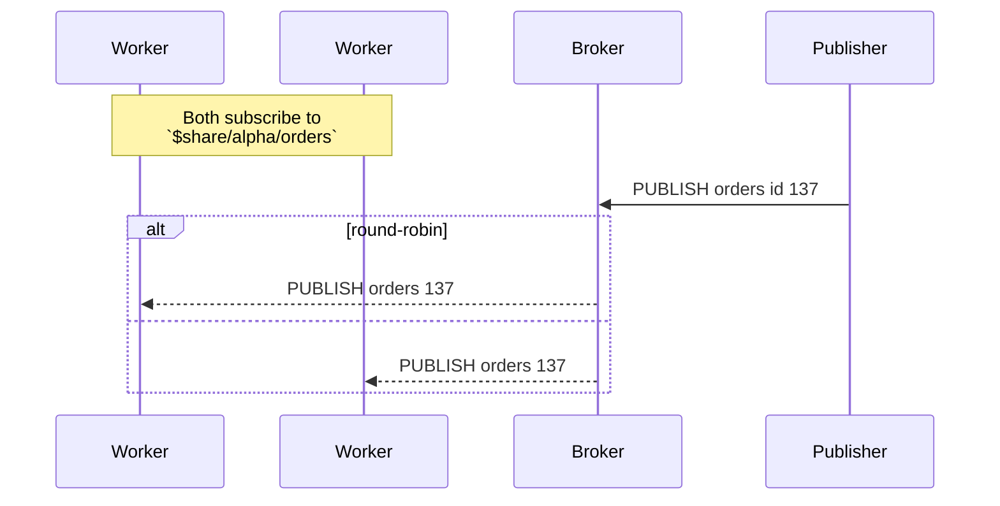

**\$share/group/topic** spreads messages across a worker pool to parallelise processing.

---

## 8  Broker Cluster Topology (Horizontal Scale)

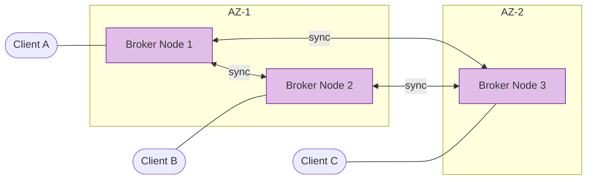

Modern brokers (HiveMQ, EMQX) replicate sessions & retained data across nodes for **fault‑tolerance** and millions of connections.

---

## 9  Topic Design Cheat‑Sheet

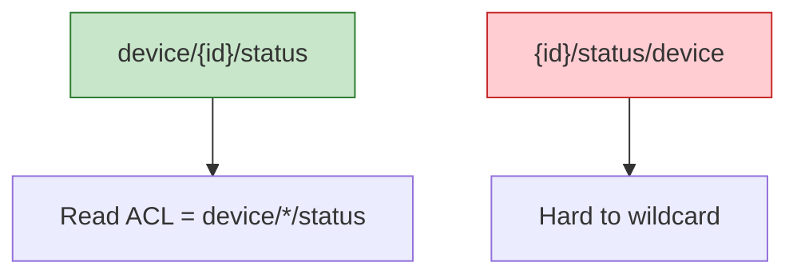

Put **static nouns first** ➜ simpler ACLs & filters.

---

## 10  Troubleshooting Flow

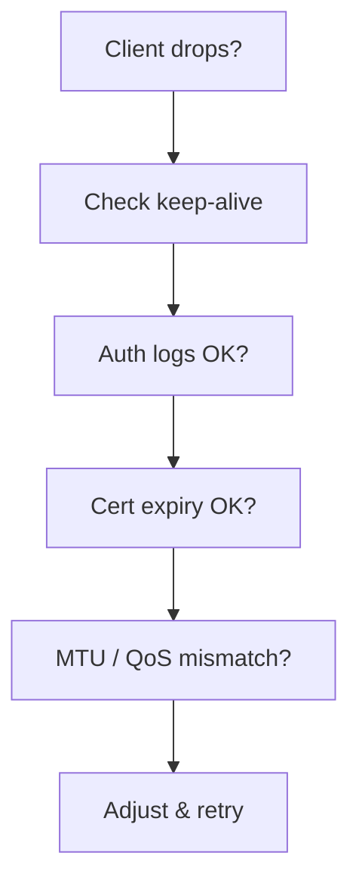
