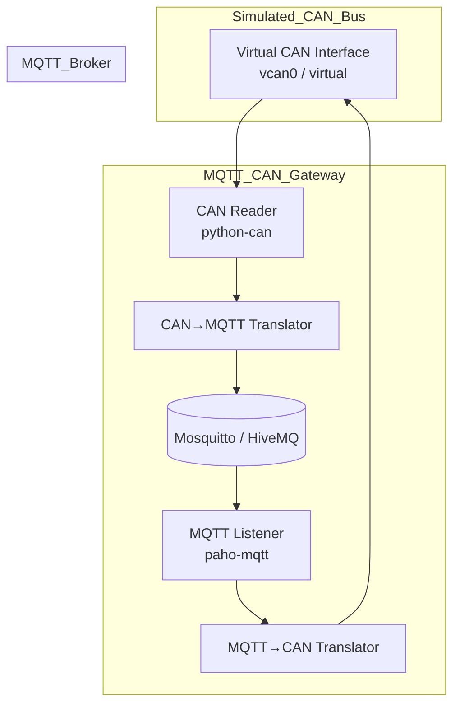

# 🚍 MQTT–CAN Simulated Gateway

This project implements a **bidirectional gateway** between MQTT and CAN using **Python** and **simulated CAN hardware**. It allows publishing CAN messages to MQTT and receiving MQTT messages to be sent over a virtual CAN bus — fully emulated, requiring **no physical CAN interface**.

---

## 📊 Architecture



---

## 🔧 Features

* ✅ **Simulated CAN Bus** on Windows using `python-can` virtual backend.
* 🔁 **Bidirectional translation**: MQTT → CAN and CAN → MQTT.
* 🧪 Includes a **test sender** to simulate CAN messages.
* 🌐 MQTT broker support (local or public like [HiveMQ](https://www.hivemq.com)).

---

## 📁 Project Structure

```
mqtt_can_gateway/
├── bridge/               # Message translation logic
│   └── translator.py
├── can/                  # CAN interface abstraction (virtual)
│   └── can_interface.py
├── mqtt/                 # MQTT client logic
│   └── mqtt_client.py
├── test/                 # CAN simulation/test tool
│   └── can_sender.py
├── main.py               # Main gateway loop
├── can_config.ini        # CAN bus configuration for python-can
├── requirements.txt
└── README.md
```

---

## 🚀 Quick Start

### 1. 🔌 Install Dependencies

```bash
pip install -r requirements.txt
```

### 2. ▶️ Run the Gateway

```bash
python main.py
```

### 3. 🧪 Simulate CAN Messages

In a separate terminal:

```bash
python test/can_sender.py
```

### 4. 📡 Monitor MQTT

Use a tool like **MQTT Explorer**, or:

```bash
mosquitto_sub -h broker.hivemq.com -t "can/out/#"
```

---

## 🔁 Topics & Data Flow

| Direction  | MQTT Topic Pattern | Example ID | Payload (Hex) |
| ---------- | ------------------ | ---------- | ------------- |
| CAN → MQTT | `can/out/0x123`    | `0x123`    | `01020304`    |
| MQTT → CAN | `can/in/0x200`     | `0x200`    | `0A0B0C0D`    |

---

## 💡 Tips

* No physical CAN adapter is needed.
* Customize `mqtt_client.py` for your broker address.
* Use `print()` statements in the code to trace live message activity.
